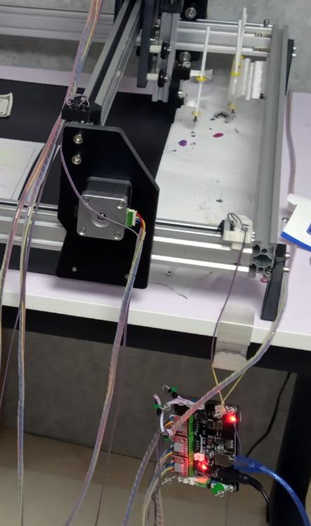

# Cartman

control your Cartman cartesian robot via a serial port on your computer from python.



## Installation

```bash
pip install pyserial
git clone https://github.com/ctmakro/cartman
pip install -e cartman # "-e" means "edit mode"
```

## Update (In case newer versions came out)

```bash
cd cartman
git pull
```

## Basic Usage

```python
from cartman import bot

b = bot()
b.home()
b.set_speed(1000)
b.goto(x=10,y=10)
b.sync()
```

## Get into the details

Make sure you read the **Cartman User Manual** before trying anything here.

The Cartman robot is connected to your computer via a USB-serial link. When you instantiate the `bot` class, you will be prompted with a list of available serial ports on your OS. The chosen port will be connected.

you can of course initialize the class with a serial port of your choice (instead of prompting the user) as follows:

```python
b = bot(name='COM2')
```

The class will print out everything it sends and receives via serial. you can suppress the printouts by specifying `verbose=False` on init:

```python
b = bot(verbose=False)
```

After connected to the specified serial port, the controller board will likely reset itself, so we have to wait until the bot is ready to receive commands. The library will repeatedly send `$X` command to the bot and wait for an `ok` response. The call will block when waiting for an `ok` response.

The initializer will return after the expected `ok` arrives. You can now send more commands to the bot.

```python
b.command_ok('G1 X100 Y100')
```

The call above sends the command `G1 X100 Y100` to the bot and returns after receiving an `ok` response.

`b.send(c)` is shorthand for `b.command_ok(c)`

`b.home()` is shorthand for the command `$H`.

`b.goto(x=100, y=20, z=-5, f=1000)` is shorthand for the command `G1X100Y20Z-5F1000`.

`b.set_speed(1000)` is shorthand for the command `G1F1000`. The bot will not move before a speed is specified.

`b.sync()`, `b.join()`, `b.wait_until_idle()` is shorthand for "wait until the bot got into its 'Idle' state". Three methods are identical.

When you send a movement command to the bot, the call usually returns before the command is executed. The command will be stored in a buffer within the controller board, which enables the bot to lookahead and plan the motions with appropriate speed transitions.

So if you send a bunch of commands to the bot, then immediately quit the python script, the serial port will be closed before the bot finishes all the movement. Unfortunately this particular controller board will reset itself when a host disconnects, which will cause the bot to stop before all buffered commands are executed.

The solution is to call `b.sync()` at the end of your script, which will only return after all buffered commands are executed.
